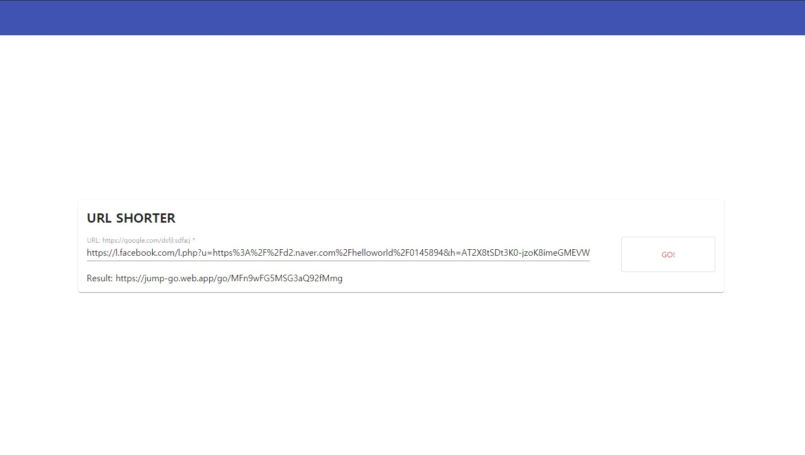

# JUMP-GO
긴 URL을 짧게 줄여주는 서비스

## Example

변환하기 전 URL
```
https://l.facebook.com/l.php?u=https%3A%2F%2Fd2.naver.com%2Fhelloworld%2F0145894&h=AT2X8tSDt3K0-jzoK8imeGMEVWdRPeVaEj1ur-z6GhTfRV-UwCfKzv6uqXQX-1M2ZMj3RfqxOijw2janVrOIyP94AugKOOt05-bWd2mbNoW1d5ivRL2US4JW-apA6yy67Apm7c_Nons&s=1

"https://l.facebook.com/l.php?u=https%3A%2F%2Fd2.naver.com%2Fhelloworld%2F0145894&h=AT2X8tSDt3K0-jzoK8imeGMEVWdRPeVaEj1ur-z6GhTfRV-UwCfKzv6uqXQX-1M2ZMj3RfqxOijw2janVrOIyP94AugKOOt05-bWd2mbNoW1d5ivRL2US4JW-apA6yy67Apm7c_Nons&s=1".length
226
```

변환 후 URL
```
https://jump-go.web.app/go/5XltiREh8OswA2xwwNI6

"https://jump-go.web.app/go/5XltiREh8OswA2xwwNI6".length
47
```

## How to work?



폼에 아주 엄청 긴~~~ URL을 입력한 후 GO 버튼을 누르면 
`Firebase - Firestore` 에 원래 URL을 저장하고, ID 를 반환함
이후, 하단에 짧아진 URL이 생성

짧아진 URL로 접속을 하면 `Firebase - Firestore`에 저장된 원래의 URL을
가져와 리다이렉션을 함